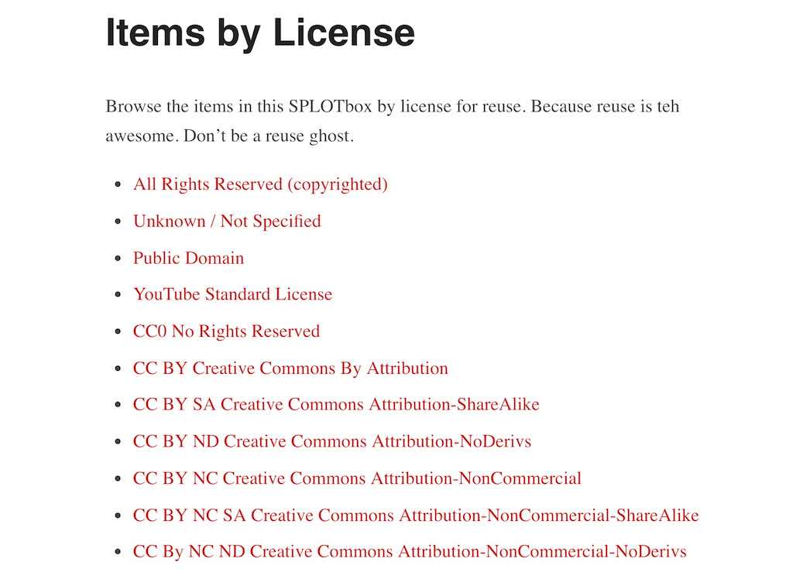

# SPLOTbox

A [SPLOT](http://splot.ca/) for building collections of audio and video media, like a media jukebox.

by Alan Levine https://cog.dog or http://cogdogblog.com/

-----
*If this kind of stuff has any value to you, please consider supporting me so I can do more!*

 

----- 

## What is this?

This Wordpress Theme powers [SPLOTbox](http://splot.ca/splotbox/) a site to allow collections of audio and video content (termed "items") where contributions can be made without requiring logins or providing personally identifying information. This is done by using a generic author account that is silently activated. The user never sees any sign of the innards of Wordpress but can create descriptions and provide more information for each media item added. 

The options can allow you to offer a field for add the media by URL (For video, from YouTube or Vimeo, and for audio content from SoundCloud or any link to an mp3, ogg, or m4a sound. A site owner can also enable an upload button for sounds files in those same three formats. Other features are to provide fields for (and require or not), descriptions, a credit source name and a selection of a reuse licenses.

This is an improvement and enhancement of the first generation [TRU Sounder SPLOT](https://github.com/cogdog/splot-sounder).

See also [CogDogBlog for posts about SPLOTbox](https://cogdogblog.com/tag/splotbox/).

## With Thanks

SPLOTs have no venture capital, no IPOs, no real funding at all. But they have been helped along by a few groups worth recognizing with an icon and a link.

SPLOTbox was evolved from an earlier [Sound Collector](http://splot.ca/splots/tru-sounder/) created under [Thompson Rivers University Open Learning Fellowship](http://cogdog.trubox.ca/). Incentive for the first SPLOTbox was provided with a small seed grant from the [University of Saskatchewan](http://usask.ca/). Further development was supported in part by a [Reclaim Hosting Fellowship](http://reclaimhosting.com), an [OpenETC grant](https://opened.ca), and ongoing support by [Patreon patrons](https://patreon.com/cogdog).

        

### See It In Action

* [Coventry University DMLL Video Archive](http://videos.dmllmedia.coventry.domains/)
* [GEOL 109  The Earth and Life Through Time](http://sites.usask.ca/geol109/) Student-Curated Geology Video Collection from the University of Saskatchewan
* [OpenMed Video Collection](https://videos.openmedproject.eu/) Audiovisual OER produced for the OpenMed Project
* [OWLTECH Perspectives](http://perspectives.owlteh.org/) Open Web For Learning & Teaching Expertise Hub -- a series of videos contributed by educators and learners who are actively engaged in using the Open Web within their practice.
* [MURSDLeads Author Series](http://eduquinn.com/Interviews/) interviews with leading education authors
* [SPLOTbox](http://splot.ca/box/) - the demo site

[Find more in The Google](https://www.google.ca/search?q="SPLOTbox+theme+is+based+on+Garfunkel"+-site:splot.ca)?

If you make a SPLOTbox site, please please pretty *please* fork this repo to edit this Readme with a link to your new site, submit a pull request to send to this site.

If you have problems, feature suggestions, piles of unmarked bills to send my way, please [contact me via the issues area](https://github.com/cogdog/splotbox/issues) on this repo.

## Requirements
I will make the big leap in that you have a self hosted Wordpress site and can install themes. The SPLOTbox theme is a child theme based on the  [Garfunkle theme by Anders Noren](https://wordpress.org/themes/garfunkel). Install that first from your Wordpress Dashboard.

Then install the splotbox theme to Wordpress directly by ftping or using the downloaded ZIP for this repo.

## Setting Up a New SPLOTbox site

In this theme Wordpress `Posts` are renamed `Items` but have all the attributes of garden variety blog posts.

(1) Create a fresh new Wordpress site. 

(2) Create a user with login name of `sharer` with Author role. No one actually uses the account, the site invisibly logs in guests as this user. Make note of the password that Wordpress generated. Make it cryptic.

(3) Install the [Garfunkel theme](https://wordpress.org/themes/garfunkel) from the Wordpress Dashboard (I'll gamble that you know how to install themes, search on `Garfunkel` from **Appearance** -- **Themes** -- **Add New**. 

(4) Install the SPLOTbox theme downloaded as part of this repo (use the green **clone or download** button above or [download directly](https://github.com/cogdog/splotbox/archive/master.zip)).

(5) Activate SPLOTbox as the site's theme. In this theme posts are renamed **items** and thus on the dashboard:

(6) Install and activate the [Remove Dashboard Access plugin](https://wordpress.org/plugins/remove-dashboard-access-for-non-admins/).  The splotbox theme's options panel will nudge you to install it. It is used to keep the logged in user from seeing the admin side of Wordpress. Any attempt to reach the dashboard outside of Administrators or editors results in a redirect to the front of the site. The site will work without it, but it makes your collector site a tad more bullet proof.

In its settings, restrict access to **Editors and Administrators** or just **Administrators** depending if you will have a moderator user. The default redirect should be for the main URL of the site. 

(7) You might want to set up in advance some Wordpress Categories for your Items; in the SPLOTbox options you will choose one as default (and for all that is holy, *change the name of the Uncategorized category*!

## Updating the Theme

Download the latest version of the theme, expand the archive, and then replace all files in your server under `wp-content/themes/splotbox` via ftp/sftp. Or if you prefer not to mess around with file transfer, install the plugin [Easy Theme and Plugin Upgrades](https://wordpress.org/plugins/easy-theme-and-plugin-upgrades/) which allows you to update the theme by uploading the zip file again like when you first installed (because wordpress does not provide this capability).

## Setting Up The Site Via SPLOTbox options

These instructions are a reference for the settings within the SPLOTbox; if you are reading this, you got as far as installing and activating the theme. Below are basic instructions for all of the theme options, which, if this were designed well, you likely do not need me to explain, but #BecauseDocumentation here we go.

## Access and Publishing Controls

Leave the **Access Code** field blank if you want any visitor to be able to see and use the submission form on your site.

If you want to provide an access code (a very weak password), just enter it in this field. Any links to the form will be sent to the **front desk** page where a visitor must enter in the code you have entered here to see the form.

Enter a decent **Access Hint** that will be displayed if someone does not enter the correct code.

The Status for New Items lets you set up moderation for  submissions (by choosing `Set to draft`) whereas `Publish immediately` provides instant gratification to your visitors, though leaves open the problems of a site where anyone can publish (the latter option thus works for sites where you set up an **Access Code** as described above).

## Media Support

The checkboxes here allow you to control the types of sites that are able to add content directly to a SPLOTbox site by URL only (using WordPress embed or built in support for Internet Archive and Adobe Spark).

This would allow you to maintain a site for only certain sources, say only video from YouTube or vimeo.

These checkboxes **should** be enabled, but you may have to manually set them.

Also, if you only want visitors adding media by URL, you can hide the uploader:

## Item Sorting 

The default settings for the display of itms are for typical blogs where newest content is displayed first. The sort options allow you to change that across the site- the home page, category/tag archives, and search results.

**Date Published** is the default option, the order is **Descending**, or newest first, change to **Ascending** to have oldest items appear first. 

Change the sort otder to **Title** to... yes... sort items alphabetically by each item's title.  Use **Ascending** for alphabetical order (A-Z) or **Descending** to reverse (Z-A).

## Other Settings

Select the default category that should be used for new items.

Set this option to provide a field for visitors to enter a caption for their shared image, and whether to require that something be entered. By setting to **No** this will not appear on the submission form.

Check **Enable Comments on Items**  to add a standard blog comment field at the bottom of all published items.

You can choose to suppress the description field (if you want media shared only), or if making the description field available, you can require that it has something written in it. 

Plus, you can choose to use the plain text area input (simple descriptions, this is the default) or enable the rich text editor to allow for formatted content.

You can also choose to use a field if you want contributors to provide a source to credit for the media item.

Enter email addresses for people who should be notified of new submissions.

## License and Attribution

The **Use License Settings** enables a drop down menu offering a variety of options to indicate Creative Commons licenses as well as `All Rights Reserved` (boo!), `Usage Rights Unknown`, and `YouTube Standard License` which really just lets you embed videos..

Enabling the **Cut and Paste Attribution** adds to the display a field with an automatically formed attribution statement (based on the items's rights license choice) that can be copied after clicking on the text. Neat, eh? Attribution is a good thing.

## Author Account Setup
 
To provide access to the media uploader, this site uses a Wordpress Authoring Role account that is logged into invisibly to your site. So your site needs a user account with a name of **sharer** and a role of **Author**. If this site is on a mulitsite Wordpress install, and the SPLOTBox has been used on another site, the `sharer` account already exists, so you need to add it to the site via the Author tools. 

If this account does not exist, the options page will provide a link to create it now.

For an email you can use a fictitious one on your domain. We suggest using the strong password that Wordpress suggests.

## Customize the Share Form

You can now customize the field labels and the descriptions of the form where people submit new items to a SPLOTbox site. On your site navigate to the share form, and  activate the Wordpress Customizer from the admin bar. 

There is a special section at the bottom to open:

Then from this pane, open "Share Form" (eventually the theme options will live here too)

And then you will see a series of fields to edit for all form field elements. For each, you can edit the title/label of the field and the prompt that appears below. As you type in the customizer fields on the left, you will see a live preview on the right:

## Browse by Licenses

As of version 0.4 SPLOTbox provides links that display archives of content that have the same reuse license (if the feature is activated via the SPLOTbox options). Just make sure there is a Wordpress Page with the url / slug `/licensed` This page is created automatically on new sites, or simply by activating the theme again (activate the parent Garfunkel, then activate SPLOTbox again).

This page (see [example](http://splot.ca/box/licensed/)) provides links to view all content with the licenses available on the share form (it only displays options that have media using them). The url ending in `licensed/cc-by` yields all items with a Creative Commons CC By Attribution license [example](http://splot.ca/box/licensed/cc-by).

Use the page to find links to the ones you wish to use and add to your site's menus or widgets. If the links do not work, you may have to go to **Settings** -- **Permalinks** and just click save to regenerate the settings.

## Browse by Licenses

As of version 1.1 SPLOTbox provides links that display archives of content that have the same reuse license (if the feature is activated via the SPLOTbox options). Just make sure there is a Wordpress Page with the url / slug `/licensed` This page is created automatically on new sites, or simply by activating the theme again (activate the parent Garfunkel, then activate TRU Collector again).

This page (see [example](http://splot.ca/box/licensed/)) provides links to view all content with the licenses available on the sharing form. The url including `licensed/cc-by` yields all items with a Creative Commons CC By Attribution license [example](http://splot.ca/box/licensed/cc-by).

Use the page to find links to the ones you wish to use and add to your site's menus or widgets. If the links do not work, you may have to go to **Settings** -- **Permalinks** and just click save to regenerate the settings.

For extra flexibility there is a `[licensed]` shortcode that can be used in a widget or any page to display the same index list in a sidebar. By default, it lists only licenses used (e.g. it skips licenses with zero uses); to show all licenses, use the code `[licensed show="all"]`.

## Other Wordpressy Things You Might Want to Do

I like short links, so I typically use a Custom Permalink setting (under `Settings -- Permalinks`) of `/%post_id%/'

 

The theme creates three Pages for you with custom templates. You can edit their content to provide additional information prompt:

* **Desk** The screen where users must enter an access code
* **Share** The page that includes the form people use to upload content

Set up your own menus as needed; make sure that you click the **Location** tab to tell Wordpress to use the menu you create as the **Primary** menu.

 

Get rid of the default widgets on the site; make it your own. In this theme, the widgets do not appear on the front page, but will be there in single entries

 

Go build collections of media!

## Relatively Cool New Features & Updates

* (1.9) Support included now for Giphy, Mixcloud, Flickr, Speakerdeck, and Slideshare, plus uploads now include ability to add images. The theme options can be used to limit the sites enabled. Also, the theme no longer needs a separate page for the random link generator (it's done all with code).
* (1.6-1.8) ! Yikes, someone forgot to list the new features. We are sure they were awesome.
* (1.5) Previews of submissions added to share form (displays as lightbox overlay). Pagination fixed for view by license template, shortcode added for license. Changed post format to not use content above more tag to find media URLs (Gunteberg comment tag danger), but reference media url stored in custom field (older formats still work). Tested to work with WordPress 5, Gutenberg, and newest version of parent theme. And, because the file got so long, `functions.php` has now been divided up into component files stored inside `/includes/'
* (1.0) Support added to allow submission of URLs for Adobe Spark Pages and Videos. Options added to hide form inputs for categories and tags if not needed. Fixed theme to use parent theme fonts and icons.
* (0.6) Template added to display media by type of open license applied
* (0.4) Support for Internet Archive audio and video embed from URL. Page genertor of links to all content with the same reuse license
* (0.3) Edit labels and instructions on the upload form using the Wordpress Customizer
* (0.2) A rich text editor can now be enabled for the description fields or you can opt to use the simpler plain text input text area for descriptions.
* (0.15) On new installs where no menus are defined, the theme generates a simple menu rather than listing all pages 

