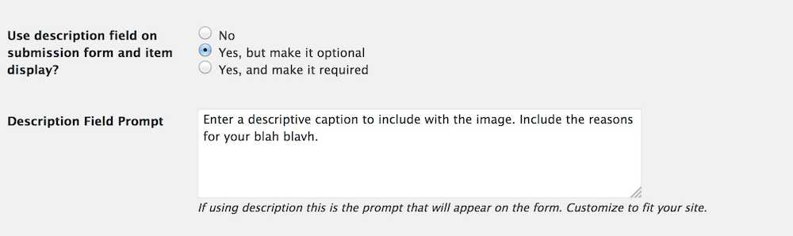
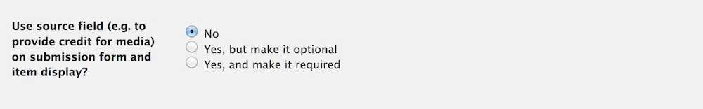
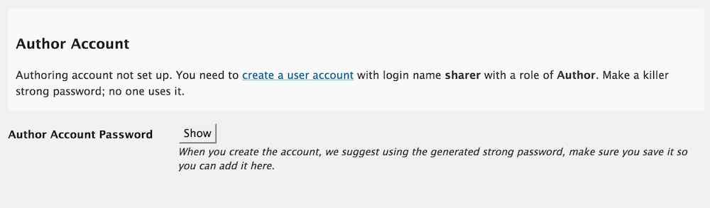
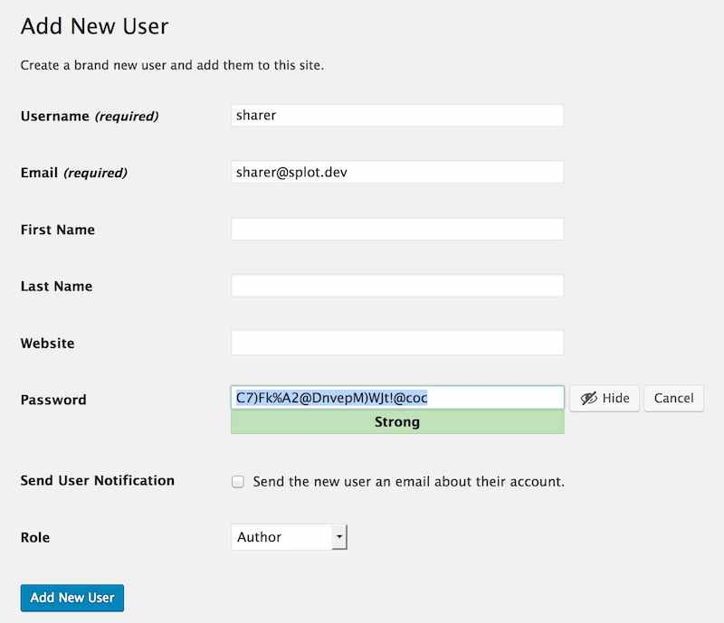
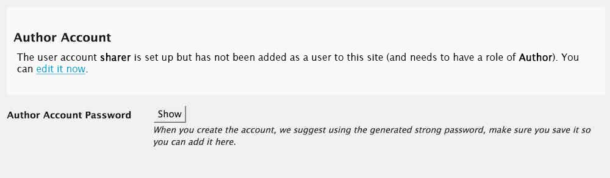
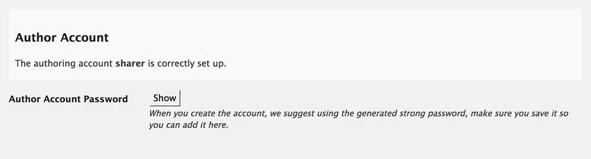

# SPLOTbox

A [SPLOT](http://splot.ca/) for building collections of audio and video media, like a media jukebox.

by Alan Levine https://cog.dog or http://cogdogblog.com/

-----
*If this kind of stuff has any value to you, please consider supporting me so I can do more!*

 

----- 

## What is this?

This Wordpress Theme powers [SPLOTbox](http://splot.ca/splotbox/) a site to allow collections of audio and video content (termed "items") where contributions can be made without requiring logins or providing personally identifying information. This is done by using a generic author account that is silently activated. The user never sees any sign of the innards of Wordpress but can create descriptions and provide more information for each media item added. 

The options can allow you to offer a field for add the media by URL (For video, from YouTube or Vimeo, and for audio content from SoundCloud or any link to an mp3, ogg, or m4a sound. A site owner can also enable an upload button for sounds files in those same three formats. Other features are to provide fields for (and require or not), descriptions, a credit source name and a selection of a reuse licenses.

This is an improvement and enhancement of the first generation [TRU Sounder SPLOT](https://github.com/cogdog/splot-sounder).

### See It In Action

* [SPLOTbox](http://splot.ca/box/) - the development and very first site, stuff can and will break

And if you make a SPLOTbox site, please please pretty *please* fork this repo to edit this Readme with a link to your new site.

If you have problems, feature suggestions, piles of unmarked bills to send my way, please [contact me via the issues area](https://github.com/cogdog/splotbox/issues) on this repo.

## Requirements
I will make the big leap in that you have a self hosted Wordpress site and can install themes. The SPLOTbox theme is a child theme based on the  [Garfunkle theme by Anders Noren](https://wordpress.org/themes/garfunkel). Install that first from your Wordpress Dashboard.

Then install the splotbox theme to Wordpress directly by ftping or using the downloaded ZIP for this repo.

## Setting Up a New SPLOTbox site

In this theme Wordpress `Posts` are renamed `Items` but have all the attributes of garden variety blog posts.

(1) Create a fresh new Wordpress site. 

(2) Create a user with login name of `sharer` with Author role. No one actually uses the account, the site invisibly logs in guests as this user. Make note of the password that Wordpress generated. Make it cryptic.

(3) Install the [Garfunkel theme](https://wordpress.org/themes/garfunkel) from the Wordpress Dashboard (I'll gamble that you know how to install themes, search on `Garfunkel` from **Appearance** -- **Themes** -- **Add New**. 

(4) Install the SPLOTbox theme downloaded as part of this repo (use the green **clone or download** button above or [download directly](https://github.com/cogdog/splotbox/archive/master.zip)).

(5) Activate SPLOTbox as the site's theme. In this theme posts are renamed **items** and thus on the dashboard:

(6) Install and activate the [Remove Dashboard Access plugin](https://wordpress.org/plugins/remove-dashboard-access-for-non-admins/).  The splotbox theme's options panel will nudge you to install it. It is used to keep the logged in user from seeing the admin side of Wordpress. Any attempt to reach the dashboard outside of Administrators or editors results in a redirect to the front of the site. The site will work without it, but it makes your collector site a tad more bullet proof.

In its settings, restrict access to **Editors and Administrators** or just **Administrators** depending if you will have a moderator user. The default redirect should be for the main URL of the site. 

(7) You might want to set up in advance some Wordpress Categories for your Items; in the SPLOTbox options you will choose one as default (and for all that is holy, *change the name of the Uncategorized category*!

## Setting Up The Site Via SPLOTbox options

These instructions are a reference for the settings within the SPLOTbox; if you are reading this, you got as far as installing and activating the theme. Below are basic instructions for all of the theme options, which, if this were designed well, you likely do not need me to explain, but #BecauseDocumentation here we go.

## Access and Publishing Controls

Leave the **Access Code** field blank if you want any visitor to be able to see and use the submission form on your site.

If you want to provide an access code (a very weak password), just enter it in this field. Any links to the form will be sent to the **front desk** page where a visitor must enter in the code you have entered here to see the form.

Enter a decent **Access Hint** that will be displayed if someone does not enter the correct code.

The Status for New Items lets you set up moderation for  submissions (by choosing `Set to draft`) whereas `Publish immediately` provides instant gratification to your visitors, though leaves open the problems of a site where anyone can publish (the latter option thus works for sites where you set up an **Access Code** as described above).

## Item Sorting 

The default settings for the display of itms are for typical blogs where newest content is displayed first. The sort options allow you to change that across the site- the home page, category/tag archives, and search results.

**Date Published** is the default option, the order is **Descending**, or newest first, change to **Ascending** to have oldest items appear first. 

Change the sort otder to **Title** to... yes... sort items alphabetically by each item's title.  Use **Ascending** for alphabetical order (A-Z) or **Descending** to reverse (Z-A).

## Other Settings

Select the default category that should be used for new items.

Set this option to provide a field for visitors to enter a caption for their shared image, and whether to require that something be entered. By setting to **No** this will not appear on the submission form.

Check **Enable Comments on Items**  to add a standard blog comment field at the bottom of all published items.

Set **Allow Media Uploads** to `no` to remove the form field for uploading media (if you prefer all media items to come from external URLs).

You can choose to suppress the description field (if you want media shared only), or if making the description field available, you can require that it has something written in it. You can also customize the prompt that appears for the description if you want to have specific requirements. 

Plus, you can choose to use the plain text area input (simple descriptions, this is the default) or enable the rich text editor to allow for formatted content.

You can also choose to use a field if you want contributors to provide a source to credit for the media item.

Enter email addresses for people who should be notified of new submissions.

## License and Attribution

The **Use License Settings** enables a drop down menu offering a variety of options to indicate Creative Commons licenses as well as `All Rights Reserved` (boo!), `Usage Rights Unknown`, and `YouTube Standard License` which really just lets you embed videos..

Enabling the **Cut and Paste Attribution** adds to the display a field with an automatically formed attribution statement (based on the items's rights license choice) that can be copied after clicking on the text. Neat, eh? Attribution is a good thing.

## Author Account Setup

To provide access to the media uploader this site uses a Wordpress Authoring  account that is logged into invisibly to your site visitors (for anyone logged in with an Editor or Administrator account, like you, this account is not used). So your site needs an active user with a name of **sharer** and a role of **Author**.

If this account does not exist, create it now. If it does, use the instructions below to generate a new password and then add it to the SPLOTbox Options.

You can follow the link to create an account; for an email you can use a fictitious one on your domain. We suggest using the strong password that Wordpress suggests. Copy that password, and perhaps save it in a safe place. Uncheck the box about sending the new user an email. This user never reads email.

On a stand-alone Wordpress install of the SPLOTbox, you can just paste it into the option for the password field for the Splotbox options (click the **Show** button to reveal the editing field).

If this site is on a mulitsite Wordpress install and the SPLOTbox has been used on another internal site, the `sharer` account already exists. So you need to add it to the site via the Authoring tools. However, you still have to enter the password, so make sure you know the passord that was used on another site. If you do not have access to it, you will have to reset the password at the Network Admin level, and then update the password on the options of all sites using the SPLOTbox.

When everything is set up correctly, the options will indicate that you have been a good options configurator! 

If the account is incorrectly set up, when trying the SPLOTbox on a site where you are *not* logged in as an Administrator or Editor, when you try to access the collect form, you will see a Wordpress login. This nearly always means the password for the `sharer` user does not match the settings in the options.

## Updating the Theme

If you have ftp/sftp access to your site (or this can be done in a cpanel file manager), simply upload the new theme files to the `wp-content/themes` directory that includes the older version theme. 

For those that lack direct file upload access or maybe that idea sends shivers down the spine, upload and activate the [Easy Theme and Plugin Upgrades](https://wordpress.org/plugins/easy-theme-and-plugin-upgrades/) plugin -- this will allow you to upload a newer version of a theme as a ZIP archive, the same way you add a theme by uploading.

## Other Wordpressy Things You Might Want to Do

I like short links, so I typically use a Custom Permalink setting (under `Settings -- Permalinks`) of `/%post_id%/'

 

The theme creates three Pages for you with custom templates. You can edit their content to provide additional information prompt:

* **Desk** The screen where users must enter an access code
* **Share** The page that includes the form people use to upload content
* **Random** No content needed, it just performs a redirect to a random collectable. Just leave it alone.

Set up your own menus as needed; make sure that you click the **Location** tab to tell Wordpress to use the menu you create as the **Primary** menu.

 

Get rid of the default widgets on the site; make it your own. In this theme, the widgets do not appear on the front page, but will be there in single entries

 

Go build collections of media!

## Relatively Cool New Features & Updates

* A rich text editor can now be enabled for the description fields or you can opt to use the simpler plain text input text area for descriptions.
* On new installs where no menus are defined, the theme generates a simple menu rather than listing all pages 

