# SPLOTbox

A [SPLOT](http://splot.ca/) for building collections of audio, video, and image media, kind of like a jukebox (you do know what that is, right?).

by Alan Levine https://cog.dog or http://cogdogblog.com/

-----
*If this kind of stuff has any value to you, please consider supporting me so I can do more!*

 

----- 

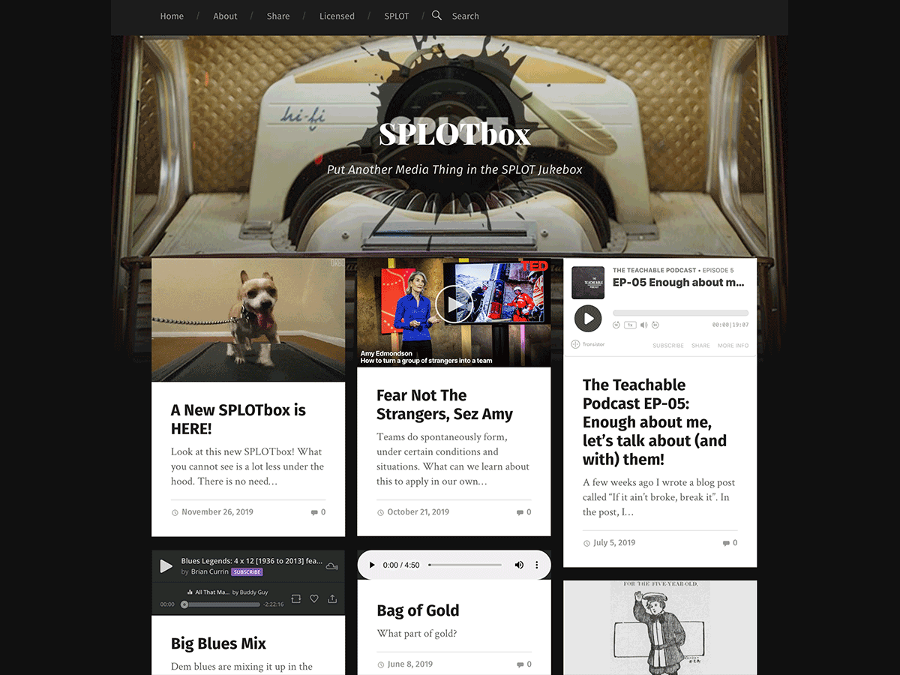

## What is this?

This Wordpress Theme powers [SPLOTbox](http://splot.ca/splotbox/) a site to allow collections of media content (termed "items") where contributions can be made without requiring logins or providing personally identifying information. 

The options can allow you to offer a field for add the media by URL from the following services,  [a subset of ones WordPress supports by Embed](https://wordpress.org/support/article/embeds/#okay-so-what-sites-can-i-embed-from): 

* Flickr photos
* Giphy animated GIFs 
* Mixcloud audio 
* Slideshare presentations
* Soundcloud audio 
* SpeakerDeck presentations
* TED Talks video 
* Vimeo video 
* YouTube video

In addition, special code has been added to support similarly for:

* Adobe Spark Pages
* Adobe Spark Videos
* Internet Archive audio or video
* Loom screencasts
* Vocaroo audio

And in this new version, we are offering a third, cool option:
* record audio directly!

Media can also be added by any direct URL to audio in mp3, ogg, or m4a formats or  jpg, png, or gif images. Site owners can also enable an upload button for image and sound files in mp3, ogg, or m4a (audi0) or jpg, png, gif (image) as well as a using a built in audio recorder.

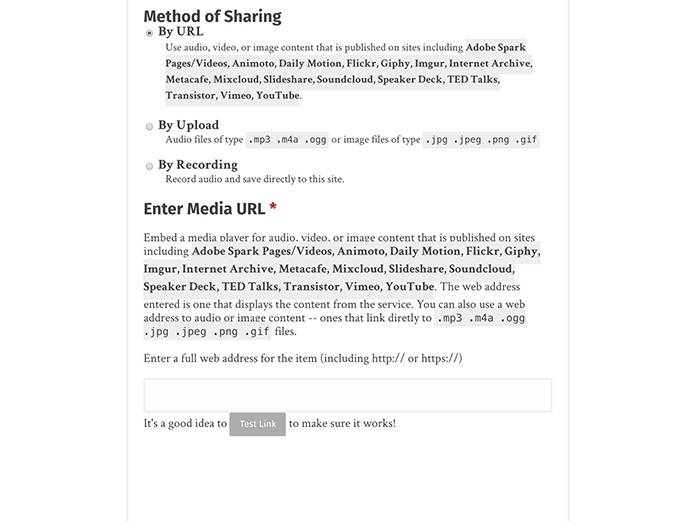

Because of the underlying device recording code (using WebRTC) a user must grant access to the site to use the microphone; **this in turn can only be done on a site running under SSL**. This requires activating / setting up an SSL certificate with your web host and activating a plugin such as [Really Simple SSL](https://en-ca.wordpress.org/plugins/really-simple-ssl/) to redirect requests from `http` to `https`.

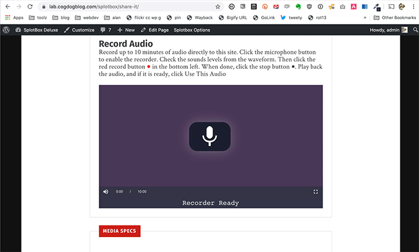

After clicking the microphone icon, if you do not see a dialog box asking to grant access to the microphone or do not see the recording controls, verify that the address of the web page for the form starts with `https`. 

Other features that can be activated in SPLOTbox are to provide entry fields for (and require or not), descriptions, a credit source name and a selection of reuse licenses.

SPLOTbox is a huge improvement and enhancement of the first generation [TRU Sounder SPLOT](https://github.com/cogdog/splot-sounder). For blogged history, see  [CogDogBlog for posts about SPLOTbox](https://cogdogblog.com/tag/splotbox/).

## How to SPLOTbox in 60 Seconds

Thanks to [Clint Lalonde](https://edtechfactotum.com/) for this nifty video

## With Thanks

SPLOTs have no venture capital, no IPOs, no real funding at all. But they have been helped along by a few groups worth recognizing with an icon and a link.

SPLOTbox was evolved from an earlier [Sound Collector](http://splot.ca/splots/tru-sounder/) created under [Thompson Rivers University Open Learning Fellowship](http://cogdog.trubox.ca/). Incentive for the first SPLOTbox was provided with a small seed grant from the [University of Saskatchewan](http://usask.ca/). Further development was supported in part by a [Reclaim Hosting Fellowship](http://reclaimhosting.com), an [OpenETC grant](https://opened.ca), and ongoing support by [Patreon patrons](https://patreon.com/cogdog).

        

### See It In Action

* [Amazing/True Stories of Openness](http://stories.cogdogblog.com) converted to SPLOTbox from another theme, amazing, eh?
* [AutoCAD for Interior Design](https://wordpress.kpu.ca/cadforid/) Kwantlen Polytechnic University
* [Ascent Success Plans](https://ascent.plymouthcreate.net/) Plymouth State University
* [Becoming a Learner](https://uwb.ds.lib.uw.edu/becomingalearner/) BCUSP 100: General Learning Strategies, UW Bothell
* [Belt and Road Observatory](http://baro.coventry.domains/) Coventry University
* [Coventry University DMLL Video Archive](https://videos.dmll.org.uk/)
* [COVDID19 and LCC: Our Stories in Voice, Sound, and Motion](https://livetogether.openlcc.net/covid19voices/) Lansing Community College
* [Elkhart Responds](https://heal.elkhart.k12.in.us/) Elkhart Community Schools
* [GEOL 109  The Earth and Life Through Time](http://sites.usask.ca/geol109/) Student-Curated Geology Video Collection from the University of Saskatchewan
* [Leave Room To Make Room](https://pod.learningnuggets.ca/) A workshop for #OLCIdeate 2020 by Terry Greene and Jonathan Lashley
* [OpenMed Video Collection](https://videos.openmedproject.eu/) Audiovisual OER produced for the OpenMed Project
* [Open Pedagogy Playlist](http://openpedagogyplaylist.com/) by Chad Flinn
* [OWLTECH Perspectives](http://perspectives.owlteh.org/) Open Web For Learning & Teaching Expertise Hub -- a series of videos contributed by educators and learners who are actively engaged in using the Open Web within their practice.
* [MURSDLeads Author Series](http://eduquinn.com/Interviews/) interviews with leading education authors
* [Quarantine Library](http://electrolibrary.org/quarantine/) 
* [SPLOTbox](http://splot.ca/box/) - one demo site
* [SPLOtbox Deluxe](https://lab.cogdogblog.com/splotbox) - anther demo site for the newest features
* [Starscapes](https://starscapes.openlcc.net/) Lansing Community College's collection of student presentations showcasing their creativity
* [TARUC @ UC 2019](http://georgehaughie.coventry.domains/TARUC2019/)
* [Center for Teaching, Learning, and Engagement](https://gccazctle.com/), Glendale Community College, Arizona

[Find more in The Google](https://www.google.ca/search?q="SPLOTbox+theme+is+based+on+Garfunkel"+-site:splot.ca)?

If you make a SPLOTbox site, please please pretty *please* fork this repo to edit this Readme with a link to your new site, submit a pull request to send to this site.

If you have problems, feature suggestions, piles of unmarked bills to send my way, please [contact me via the issues area](https://github.com/cogdog/splotbox/issues) on this repo.

### Installing SPLOTbox

Using this theme requires a self-hosted--or institutionally hosted (lucky you)-- Wordpress site (the kind that you download from [wordpress.org](http://www.wordpress.org). You cannot use this theme on the free "wordpress.com" site unless you have a business plan. Maybe check out [Reclaim Hosting](https://reclaimhosting.com/) if you choose to set up your own hosting space. 

SPLOTbox is a child theme based on [the free and elegant Garfunkel theme by Anders Noren](https://wordpress.org/themes/garfunkel). Install this theme first from within the Wordpress Dashboard under **Appearance** -- **Themes** searching on `Garfunkel`.

### Installing SPLOTbox from Scratch

You can download a ZIP file of this theme via the green **Code*" button above (use the Download Zip option). 

The zip can be uploaded directly to your site via **Themes** in the Wordpress dashboard, then **Add Theme** and finally **Upload Theme**. If you run into size upload limits or just prefer going old school like me, unzip the package and ftp the entire folder into your `wp-content/themes` directory. If installing on a "wordpress.com" site with a business plan, follow the instructions at [https://wordpress.com/support/themes/uploading-setting-up-custom-themes/](https://wordpress.com/support/themes/uploading-setting-up-custom-themes/); the theme will activate instantly.

To get SPLOTbox working all you need to do is activate the "SPLOTbox" theme when it appears in your Wordpress dashboard under **Appearance** --> **Themes**. 

In this theme, posts are renamed **items** and thus on the dashboard:

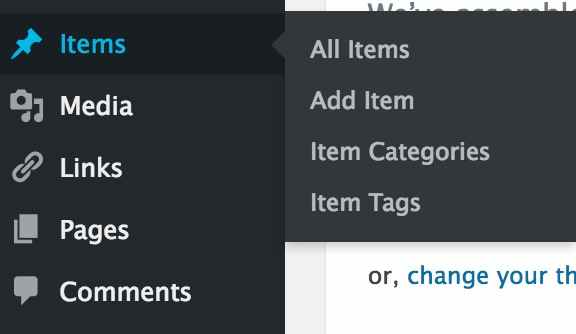

You might want to set up in advance some Wordpress Categories for your Items; in the SPLOTbox options you will choose one as default (and for all that is holy, *change the name of the Uncategorized category*!

### Updating the SPLOTbox Theme (manually)

As of WordPress version 5.5, themes uploaded as .ZIP files can now be updated the same way you installed it. Just download the newest version, and update it by going to **Themes** in the Wordpress dashboard, then **Add Theme** and finally **Upload Theme**. You will be asked to confirm updating the theme with the newer version.  

### Installing SPLOTbox in One Click with WP Pusher (get automatic updates!)

To have your site stay up to date automatically, I recommend trying the [WP Pusher plugin](https://wppusher.com/) which makes it easier to install themes and plugins that are published in GitHub. It takes a few steps to set up, but it's the most direct way to get updates to the theme.

To use WP-Pusher you will need to have or create an account on [GitHub](https://github.com/) (free). Log in. 

Next [download WP Pusher plugin](https://wppusher.com/download) as a ZIP file. From the plugins area of your Wordpress dashboard, click the **Upload Plugin** button, select that zip file to upload, and activate the plugin. If installing on a "wordpress.com" site with a business plan, follow these instructions: [https://wordpress.com/support/plugins/adding-plugins/#install-plugins-via-a-zip-file](https://wordpress.com/support/plugins/adding-plugins/#install-plugins-via-a-zip-file)

Then click the **WP Pusher** option in your Wordpress Dashboard, and then click the **GitHub** tab. Next click the **Obtain a GitHub Token** button to get an authentication token. Copy the one that is generated, paste into the field for it, and finally, click **Save GitHub** Token.

Now you are ready to install SPLOTbox! 

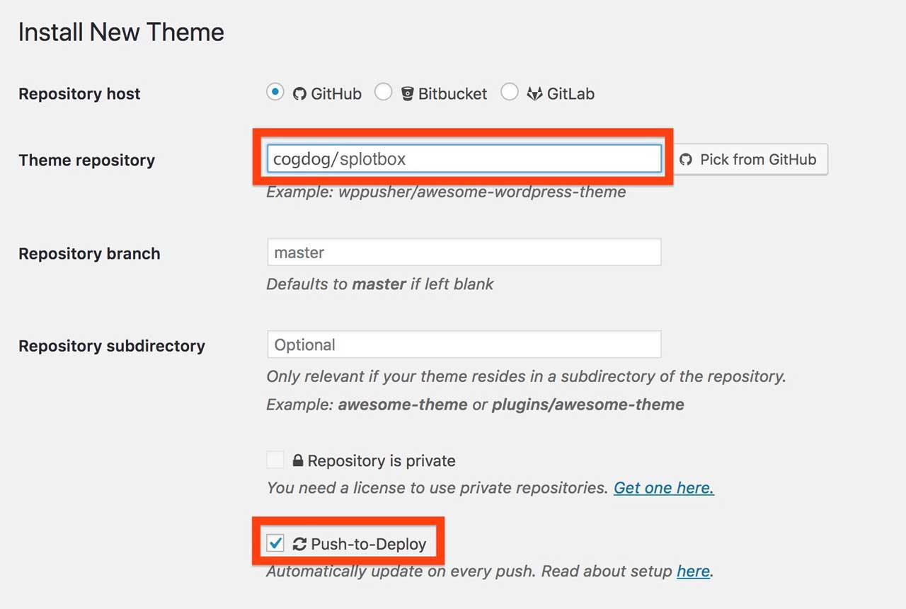

Look under **WP Pusher** for **Install Theme**. In the form that appears, under **Theme Repository**, enter `cogdog/splotbox`. Also check the option for **Push-to-Deploy** (this will automatically update your site when the theme is updated) finally, click **Install Theme**.

Woah Neo?

Not only does this install the theme without any messy download/uploads, each time I update the theme on GitHub, your site will be automatically updated to the newest version.  

## Got Issues?

If you are updating a site built with a previous version of the theme and something wonky happens, try the following:

* Don't Panic
* Go to Settings -&gt; Permalinks, and just click **Save**. Some errors are related to the way URLs are re-written in WordPress.
* Go to Appearances, and change the theme to any other theme, then change it back to S_LOTbox. There are some things the theme does on activation that can clear some issues.
* Go to the SPLOTbox Options and click **Save** as new option values may need a reset.
* If all that fails, [report an issue](https://github.com/cogdog/splotbox/issues) with as much detail that describes the situation.

## Setting Up a New SPLOTbox site

(1) Create a fresh new Wordpress site. 

(2) Install the [Garfunkel theme](https://wordpress.org/themes/garfunkel) from the Wordpress Dashboard (I'll gamble that you know how to install themes, search on `Fukasawa` from Appearances -- Themes. It does not need to be activated, it just needs to be present.

(3) Install the SPLOTbox theme via one of the methods described above.

(4) Activate SPLOTbox as the site's theme. 

(5) You might want to set up in advance some Wordpress Categories for your items; in the options you will choose one as default (and for the love of all that is holy, *change the name of the Uncategorized category*!

Next, you should configure the options.

## Setting Up The Site Via SPLOTbox options

These instructions are a reference for the settings within the SPLOTbox; if you are reading this, you got as far as installing and activating the theme. Below are basic instructions for all of the theme options, which, if this were designed well, you likely do not need me to explain, but #BecauseDocumentation here we go. 

### Theme Options and Settings
Upon activation the theme will set up a **SPLOTbox Options** link that appears in the black admin bar at the top of your Wordpress Dashboard interface (when logged in), and in the "Appearance" tab on your Wordpress Dashboard. (**SPLOTbox Options** only displays in the "Appearance" tab on the Dashboard of a "wordpress.com" site with business plan.)

## Access and Publishing Controls

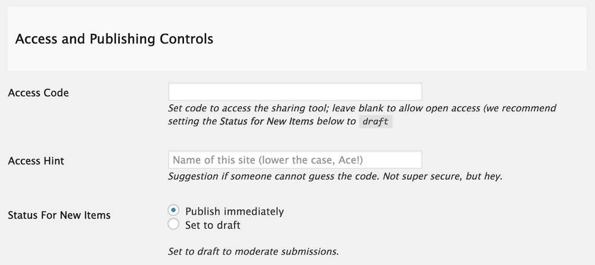

Leave the **Access Code** field blank if you want any visitor to be able to see and use the submission form on your site.

If you want to provide an access code (a very weak password), just enter it in this field. Visitors mist enter the correct code to see the full upload form.

Enter a decent **Access Hint** that will be displayed if someone does not enter the correct code.

#### Special Page Setup

Use this area to assign the two WordPress Pages used in the SPLOTbox. One to create the Sharing form and the other to display the content by reuse license applied (this can be ignored if this feature is not used).

You can now use any name you want for the URL (previously these were forced to be `/share` and `/licensed` -- this is no longer required).

If no Page is found with the correct template, you will see a prompt to create one. If the Page is found (and there might even be more than one, you can select the one you want used for each special page.

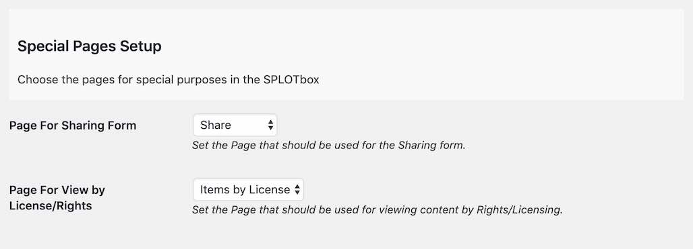

## Status for New Items

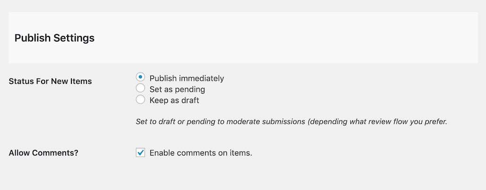

Ser the status for submitted content to your SPLOTbox. The Status for New Items lets you set up moderation for submissions (by choosing `draft` or `pending`) whereas `Publish immediately` provides instant gratification to your visitors, though leaves open the problems of a site where anyone can publish (the latter option thus works for sites where you set up an **Access Code** as described above).

There is no real difference between using `draft` or `pending` both are not public until their status is changed by a site admin; they are just organized differently in the dashboard.

Check **Enable Comments on Items**  to add a standard blog comment field at the bottom of all published items.

## Media Support

The checkboxes here allow you to control the types of sites that are able to add content directly to a SPLOTbox site by URL only (using WordPress embed or built in support for Internet Archive and Adobe Spark). This would allow you to maintain a site for only certain sources, say only video from YouTube or vimeo.

These checkboxes **should** be enabled on a new install, but you may have to manually set them use the "Select All" box.

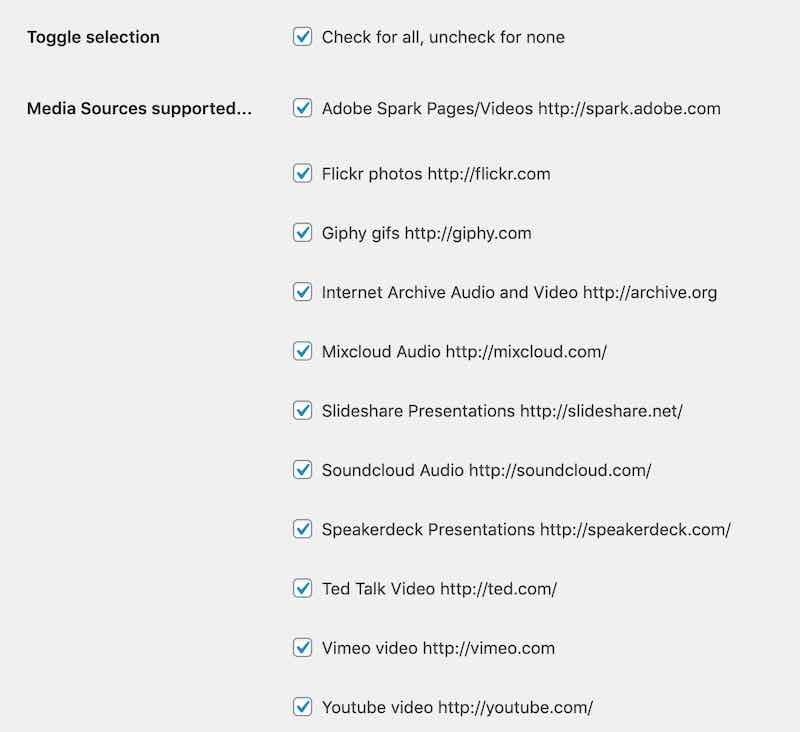

If you only want visitors adding media by URL, you can hide the uploader. And you can set a limit for upload size.

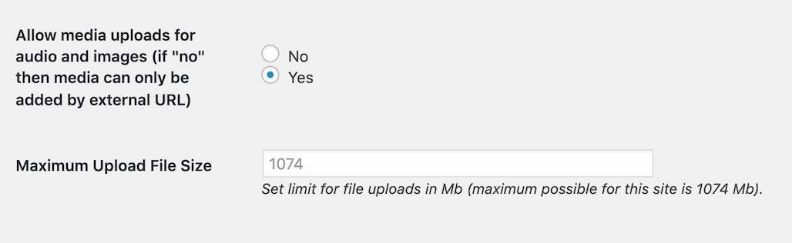

Finally, you can also enable an audio recorder as an option for adding to a SPLOTbox site (audio is directly saved to the Media Library). This can only be enabled if a site is running under SSL (if not you will not see these settings). You can also set a limit the length of audio recording time.

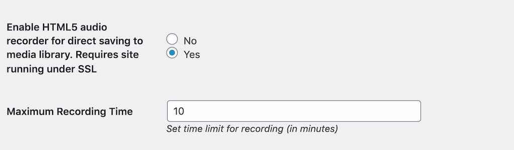

## Item Sorting 

The default settings for the display of itms are for typical blogs where newest content is displayed first. The sort options allow you to change that across the site- the home page, category/tag archives, and search results.

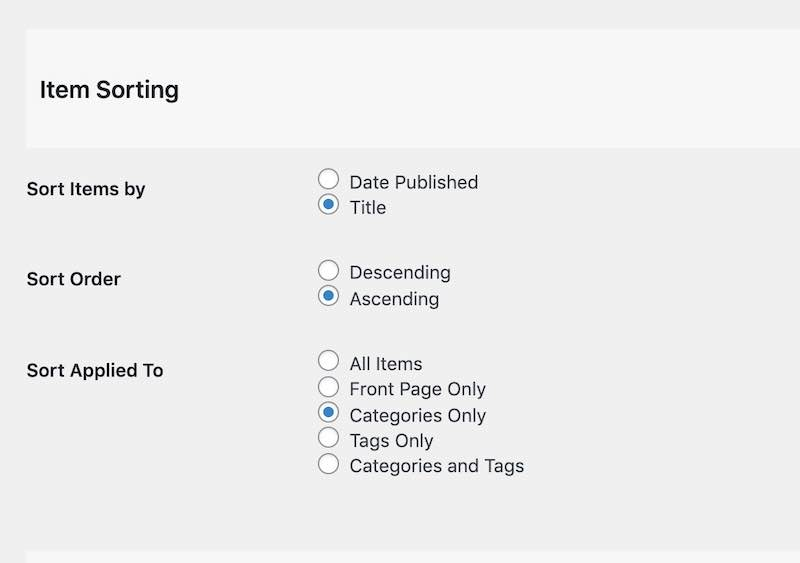

**Date Published** is the default option, the order is **Descending**, or newest first, change to **Ascending** to have oldest items appear first. 

Change the sort otder to **Title** to... yes... sort items alphabetically by each item's title.  Use **Ascending** for alphabetical order (A-Z) or **Descending** to reverse (Z-A).

## Single Item Display

You can control many of the other options to make your upload form simpler.,

You can choose to not ask visitors to set a category for their items and thus not have categories displayed on views. If you do use categories.. create them first! You can then select the default category that should be used for new items.

Like categories, you can choose to offer or hide a form field for entering tags.

You can choose to suppress the description field (if you want media shared only), or if making the description field available, you can require that it has something written in it.  The editor can either be simple text (no formatting) or the full visual editor, which also allows uploads of images to be used in the body text. Use the rich text editor when asking for longer amounts of description.

You can also choose to use a field if you want contributors to provide a source to credit for the media item.

## Admin Settings

Enter email addresses for people who should be notified of new submissions.

## License and Attribution

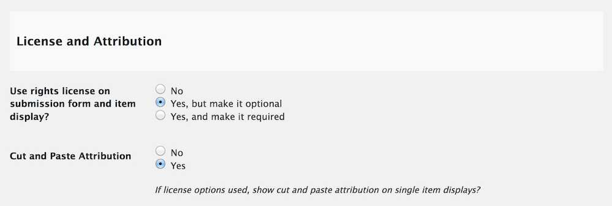

The **Use License Settings** enables a drop down menu offering a variety of options to indicate Creative Commons licenses as well as `All Rights Reserved` (boo!), `Usage Rights Unknown`, and `YouTube Standard License` which really just lets you embed videos..

Enabling the **Cut and Paste Attribution** adds to the display a field with an automatically formed attribution statement (based on the items's rights license choice) that can be copied after clicking on the text. Neat, eh? Attribution is a good thing.

## Customize the Share Form

Using the WordPress Customizer, you can now edit the field labels and the descriptions of the form where people submit new items to a SPLOTbox site. When logged into and viewing your site, look under the **Customize** menu in the admin bar for **Sharing Form** (this opens the Customizer with the sharing form in view).

There is a special SPLOTbox pane to open:

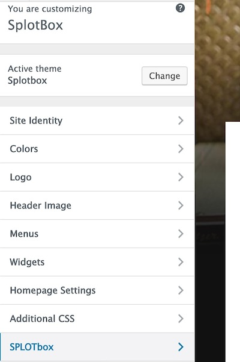

Then from this pane, open "Share Form Labels & Prompts"

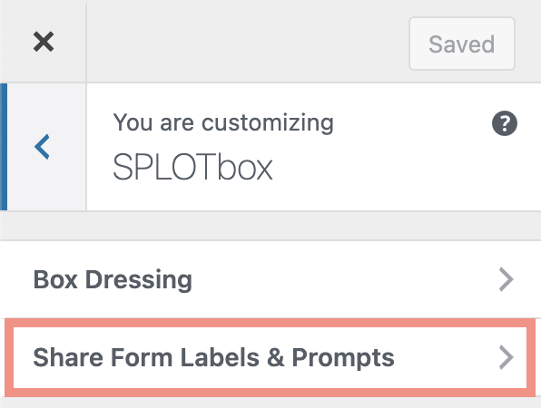

And then you will see a series of fields to edit for all form field elements. For each, you can edit the title/label of the field and the prompt that appears below. As you type in the customizer fields on the left, you will see a live preview on the right:

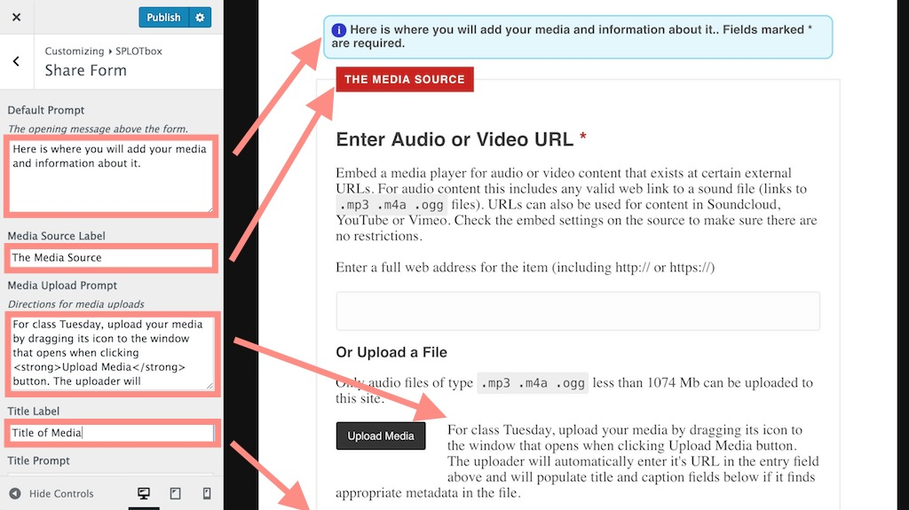

## View By License Page

SPLOTbox provides links that display archives of content that have the same reuse license (if the feature is activated via the SPLOTbox options). This page is created automatically on new sites, or simply by activating the theme again (activate the parent Garfunkel, then activate SPLOTbox again).

[This example](http://splot.ca/box/licensed/)) provides links to view all content with the licenses available on the sharing form. The url including `licensed/cc-by` yields all items with a Creative Commons CC By Attribution license [example](http://splot.ca/box/licensed/cc-by).

Use the page to find links to the ones you wish to use and add to your site's menus or widgets. If the links do not work, you may have to go to **Settings** -- **Permalinks** and just click save to regenerate the settings.

For extra flexibility there is a `[licensed]` shortcode that can be used in a widget or any page to display the same index list in a sidebar. By default, it lists only licenses used (e.g. it skips licenses with zero uses); to show all licenses, use the code `[licensed show="all"]`.

## Optional / Suggested Add-ons

### OpenGraph Tags for Social Media Sharing

If you would like Twitter Cards and Facebook shares to use the main images and provide a more complete display, install, activate, and configure a plugin like [Open Graph and Twitter Card Tags](https://wordpress.org/plugins/wonderm00ns-simple-facebook-open-graph-tags/). This adds the special [open graph tags](https://ogp.me/) to your site's pages to enable better social media share previews.

### Extending the Media Capabilities

With a bit of coding elbow grease, this theme is set up to expand the services you can use in a SPLOTbox via the [SPLOTbox Extender Plugin](https://github.com/cogdog/splotbox-extender).

### Other Wordpressy Things You Might Want to Do

I like shorter links than using a title, so I typically use a Custom Permalink setting (under `Settings -- Permalinks`) of `/%post_id%/'

 

Set up your own menus as needed; make sure that you click the **Location** tab to tell Wordpress to use the menu you create as the **Primary** menu.

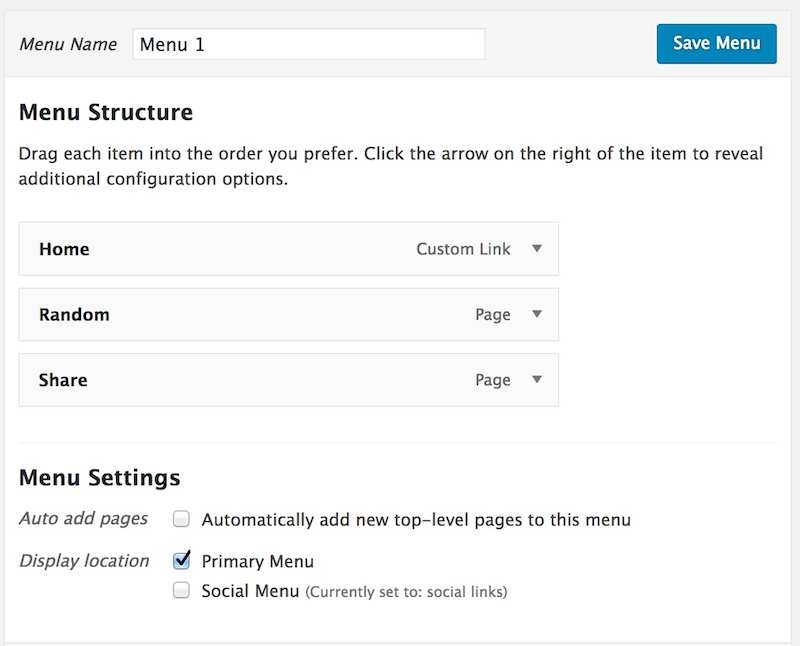 

Get rid of the default widgets on the site; make 'em your own. 

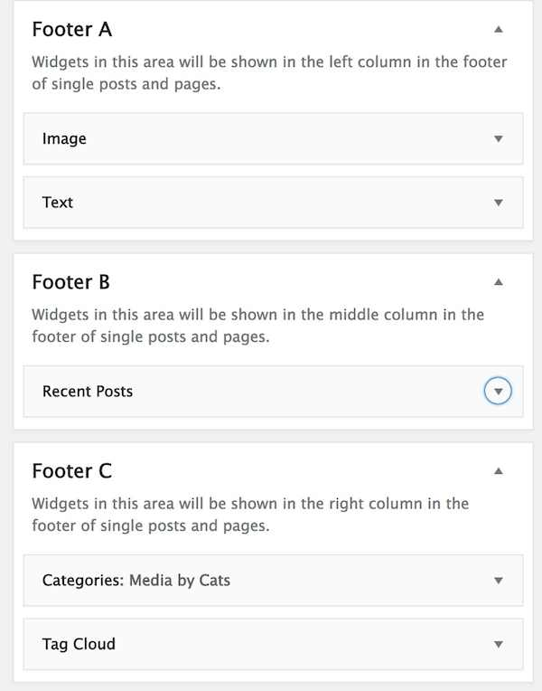 

Go build collections of media!

## Relatively Cool New Features & Updates

* (3.82) Small bug cleared to allow Customizer access to form if access code in play
* (3.81) Special feature for [GCC CTLE](https://gccazctle.com/) If using normal posts in a SPLOTbox, the display of a single item will swap in name of WordPress author and link to archive
* (3.8) Support added for Loom, even more easy peasy to do
* (3.7) Support added for Vocaroo, easy peasy to do
* (3.6) Tags suggestion on the sharing form now works
* (3.5) Customizer options to modify the comment title and add a site specific prompt
* (3.4) Fields added for alternative text in images plus media descriptions that can link t transcripts for audio/video
* (3.32) Added support for Audioboom 
* (3.2) Counts added for all archive results, fixed issue with license links
* (3.0) HTML5 Audio recorder support 
* (2.2) Admin options to select all / none for media sites, fixed bug where drafts were visible on front page
* (2.1) Better formatting for Internet Archive audio, and new checking for supported media types from the archive, added missing Customizer editing for all form labels, made new admin bar link to open Customizer to Sharing Form
* (2.0) A big revamp, removing the need for special user accounts and secret logins. No logins are used to add content. The theme us much simpler, there is no special desk page for routing the access code. And the sharing form now has radio buttons that toggle the two different means of upload (by URL or by Upload)
* (1.9) Support included now for Giphy, Mixcloud, Flickr, Speakerdeck, and Slideshare, plus uploads now include ability to add images. The theme options can be used to limit the sites enabled. Also, the theme no longer needs a separate page for the random link generator (it's done all with code).
* (1.6-1.8) ! Yikes, someone forgot to list the new features. We are sure they were awesome.
* (1.5) Previews of submissions added to share form (displays as lightbox overlay). Pagination fixed for view by license template, shortcode added for license. Changed post format to not use content above more tag to find media URLs (Gunteberg comment tag danger), but reference media url stored in custom field (older formats still work). Tested to work with WordPress 5, Gutenberg, and newest version of parent theme. And, because the file got so long, `functions.php` has now been divided up into component files stored inside `/includes/'
* (1.0) Support added to allow submission of URLs for Adobe Spark Pages and Videos. Options added to hide form inputs for categories and tags if not needed. Fixed theme to use parent theme fonts and icons.
* (0.6) Template added to display media by type of open license applied
* (0.4) Support for Internet Archive audio and video embed from URL. Page genertor of links to all content with the same reuse license
* (0.3) Edit labels and instructions on the upload form using the Wordpress Customizer
* (0.2) A rich text editor can now be enabled for the description fields or you can opt to use the simpler plain text input text area for descriptions.
* (0.15) On new installs where no menus are defined, the theme generates a simple menu rather than listing all pages 

