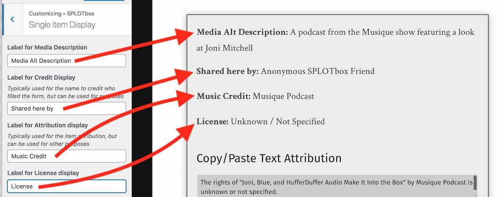
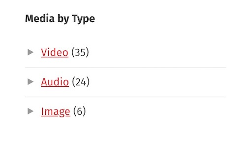

# SPLOTbox Documentation

These is a reference for the settings and making use of other WordPress features in the [SPLOTboxSPLOT WordPress theme](https://github.com/cogdog/splotbox)

Thanks to [Clint Lalonde](https://edtechfactotum.com/) for a nifty video [How to SPLOTbox in 60 Seconds](https://youtu.be/xSdxPuXEGJU)

## About Audio Recording Featuress

Because of the underlying device recording code (using WebRTC) a user must grant access to the site to use the microphone; **this in turn can only be done on a site running under SSL**. This requires activating / setting up an SSL certificate with your web host and activating a plugin such as [Really Simple SSL](https://en-ca.wordpress.org/plugins/really-simple-ssl/) to redirect requests from `http` to `https`.

## Setting Up SPLOTbox

Once you have installed SPLOTbox and can see the barebones theme staring back at you or maybe dome cheesy demo content. 

It is not very interesting. Yet. Get rid of any "Hello World" posts, say bye bye. Set your SPLOTbox Options (see below). Set up a menu. Try using the Write page to create some initial content. Poke around the Customizer settings. Fiddle with your footer widgets.  You might want to set up in advance some Wordpress Categories for your Items; in the SPLOTbox options you will choose one as default (and for all that is holy, *change the name of the Uncategorized category*!

In this theme, posts are renamed **items** and thus on the dashboard:

Next, you should configure the  options.

## Theme Options and Settings
Upon activation the theme will set up a **SPLOTbox Options** link that appears in the black admin bar at the top of your Wordpress Dashboard interface (when logged in), and in the "Appearance" tab on your Wordpress Dashboard. (**SPLOTbox Options** only displays in the "Appearance" tab on the Dashboard of a "wordpress.com" site with business plan.)

### Access and Publishing Controls

Leave the **Access Code** field blank if you want any visitor to be able to see and use the submission form on your site.

If you want to provide an access code (a very weak password), just enter it in this field. Visitors mist enter the correct code to see the full upload form.

Enter a decent **Access Hint** that will be displayed if someone does not enter the correct code.

### Special Page Setup

Use this area to assign the two WordPress Pages used in the SPLOTbox. One to create the Sharing form and the other to display the content by reuse license applied (this can be ignored if this feature is not used).

You can now use any name you want for the URL (previously these were forced to be `/share` and `/licensed` -- this is no longer required).

If no Page is found with the correct template, you will see a prompt to create one. If the Page is found (and there might even be more than one, you can select the one you want used for each special page.

### Status for New Items

Ser the status for submitted content to your SPLOTbox. The Status for New Items lets you set up moderation for submissions (by choosing `draft` or `pending`) whereas `Publish immediately` provides instant gratification to your visitors, though leaves open the problems of a site where anyone can publish (the latter option thus works for sites where you set up an **Access Code** as described above).

There is no real difference between using `draft` or `pending` both are not public until their status is changed by a site admin; they are just organized differently in the dashboard.

Check **Enable Comments on Items**  to add a standard blog comment field at the bottom of all published items.

### Media Support

The checkboxes here allow you to control the types of sites that are able to add content directly to a SPLOTbox site by URL only (using WordPress embed or built in support for Internet Archive and Adobe Spark). This would allow you to maintain a site for only certain sources, say only video from YouTube or vimeo.

These checkboxes **should** be enabled on a new install, but you may have to manually set them use the "Select All" box.

If you only want visitors adding media by URL, you can hide the uploader. And you can set a limit for upload size.

Finally, you can also enable an audio recorder as an option for adding to a SPLOTbox site (audio is directly saved to the Media Library). This can only be enabled if a site is running under SSL (if not you will not see these settings). You can also set a limit the length of audio recording time.

### Item Sorting 

The default settings for the display of itms are for typical blogs where newest content is displayed first. The sort options allow you to change that across the site- the home page, category/tag archives, and search results.

**Date Published** is the default option, the order is **Descending**, or newest first, change to **Ascending** to have oldest items appear first. 

Change the sort otder to **Title** to... yes... sort items alphabetically by each item's title.  Use **Ascending** for alphabetical order (A-Z) or **Descending** to reverse (Z-A).

Use the **Sort Applies To** option to specify where the alternative sorting is applied (for example, just on tags archive, or just the home page).

### Single Item Display

You can control many of the other options to set how the display of single items appears

You can choose to not ask visitors to set a category for their items and thus not have categories displayed on views. Another option allows you to not have visitors choose categories, but instead, use them as an admin to organze content.

  If you do use categories, create them first! You can then select the default category that should be used for new items.

Like categories, you can choose to offer or hide a form field for entering tags, or make them an admin setting only.

You can choose to suppress the description field (if you want media shared only), or if making the description field available, you can require that it has something written in it.  

The editor can either be simple text (no formatting) or the full visual editor, which also allows uploads of images to be used in the body text. Use the rich text editor when asking for longer amounts of writing added to an item.

You can also choose to use a field if you want contributors to provide a source to credit for the media item.

### Admin Settings

Enter email addresses for people who should be notified of new submissions.

### License and Attribution

The **Use License Settings** enables a drop down menu offering a variety of options to indicate Creative Commons licenses as well as `All Rights Reserved` (boo!), `Usage Rights Unknown`, and `YouTube Standard License` which really just lets you embed videos..

Enabling the **Cut and Paste Attribution** adds to the display a field with an automatically formed attribution statement (based on the items's rights license choice) that can be copied after clicking on the text. Neat, eh? Attribution is a good thing.

## Customize the Share Form

Using the WordPress Customizer, you can now edit the field labels and the descriptions of the form where people submit new items to a SPLOTbox site. When logged into and viewing your site, look under the **Customize** menu in the admin bar for **Sharing Form** (this opens the Customizer with the sharing form in view).

There is a special SPLOTbox pane to open:

Then from this pane, open "Share Form Labels & Prompts"

And then you will see a series of fields to edit for all form field elements. For each, you can edit the title/label of the field and the prompt that appears below. As you type in the customizer fields on the left, you will see a live preview on the right:

### Customize the Single Item display

The customizer also allows you to create custom labels for meta data that appears on a single item. In the Customizer, under **Splotbox** select **Single Item Display**. Navigate via the right hand view to a single item. Any four of the labels in metadata box that appears below an item's description can have a label with text edited in the customizer.

### View By License Page

SPLOTbox provides links that display archives of content that have the same reuse license (if the feature is activated via the SPLOTbox options). This page is created automatically on new sites, or simply by activating the theme again (activate the parent Garfunkel, then activate SPLOTbox again).

[This example](http://splot.ca/box/licensed/)) provides links to view all content with the licenses available on the sharing form. The url including `licensed/cc-by` yields all items with a Creative Commons CC By Attribution license [example](http://splot.ca/box/licensed/cc-by).

Use the page to find links to the ones you wish to use and add to your site's menus or widgets. If the links do not work, you may have to go to **Settings** -- **Permalinks** and just click save to regenerate the settings.

### Shortcodes

SPLOtbox includes shortc odes that are available for use in pages, widgets, sidebars

### Licenses Used

Use the `[licensed]` shortcode that can be used in a widget or any page to display a list of all licenses in a page or sidebar. By default, it lists only licenses used (e.g. it skips licenses with zero uses); to show all licenses, use the code `[licensed show="all"]`.

### Display All Tags

By request for a site that had more than 45 tags (that is the maximum that can be displayed in the Tag Cloud widget.

The basic use is just

`[taglist]`

which displays all tags used in alphabetical order, each linked to an archive, and the number of times used listed.

Optional parameters include:

* `number=10` limit to ten tags (default=0 or all tags)
* `show_count=false` hides the display of the number of times tag used (default=true)
* `mincount=2` will only show tags used 2 or more times (default=1)
* `orderby="count"` to order results by the number of times tag used (default="name")
* `order="DESC"` to list in descending order (default="ASC")
* `hide_empty=0` to list tags not used (default=1)

In use, this will display the 20 most used tags

`[taglist number=20 orderby="count" order="DESC"]`

### Count of Published items

Use [splotcount] to display the number of all published items

## Other Wordpressy Things You Might Want to Do

I like shorter links than using a title, so I typically use a Custom Permalink setting (under `Settings -- Permalinks`) of `/%post_id%/'

 

Set up your own menus as needed; make sure that you click the **Location** tab to tell Wordpress to use the menu you create as the **Primary** menu.

 

Get rid of the default widgets on the site; make 'em your own. 

 

Go build collections of media!

## Optional / Suggested Plugins

### Extending the Media Capabilities

With a bit of coding elbow grease, this theme is set up to expand the services you can use in a SPLOTbox via the [SPLOTbox Extender Plugin](https://github.com/cogdog/splotbox-extender).

This includes:

* Add support for [others that WordPress supports ](https://wordpress.org/support/article/embeds/#okay-so-what-sites-can-i-embed-from) that are not made available in the theme.
*. Create custom code to add support for additional sites. This is a case where the URL for a media item can be parsed to identify the source, e.g. for Internet Archive built into the theme and also to construct the iframe embed code
*. For services that offer oEmbed URLs, you can add code that adds these sites as additional providers (e.k. [Kaltura media servers](https://www.kaltura.org))

### OpenGraph Tags for Social Media Sharing

If you would like Twitter Cards and Facebook shares to use the main images and provide a more complete display, install, activate, and configure a plugin like [Open Graph and Twitter Card Tags](https://wordpress.org/plugins/wonderm00ns-simple-facebook-open-graph-tags/). This adds the special [open graph tags](https://ogp.me/) to your site's pages to enable better social media share previews.

### Widget For Media Types List

Media in a SPLOTbox is identified as audio, video, or image by using WordPress Post Formats. As these are technically a terms on a WordPress taxonomy, the [List Custom Taxonomy Widget plugin](https://wordpress.org/plugins/list-custom-taxonomy-widget/) can be used to add a widget that can produce something like:

 

In the widget, for the choices of Taxonomy, use `post_format`.

These provide links that can be used elsewhere (e.g. menus?) for media type archives, e.g. from the demo site

* https://splot.ca/box/type/audio/
* https://splot.ca/box/type/image/
* https://splot.ca/box/type/video/

The main theme includes CSS to match the format of other widgets in the parent Garfunkel theme.

## Got Issues?

If you are updating a site built with a previous version of the theme and something wonky happens, try the following:

* Don't Panic
* Go to Settings -&gt; Permalinks, and just click **Save**. Some errors are related to the way URLs are re-written in WordPress.
* Go to Appearances, and change the theme to any other theme, then change it back to SPLOTbox. There are some things the theme does on activation that can clear some issues.
* Go to the SPLOTbox Options and click **Save** as new option values may need a reset.
* If all that fails, [report an issue](https://github.com/cogdog/splotbox/issues) with as much detail that describes the situation.

## Updating The SPLOTbox theme

Current version 

Compare this to the version of SPLOTbox reported in your list of themes. Note that WordPress's reporting of themes being up to date does **not** reflect custom themes such as this one.  If what you see is less than the version above, here is how to update your copy of SPLOTbox. 

If you [installed SPLOTbox using the WP-Pusher plugin[(https://github.com/cogdog/splotbox/blob/master/install.md#installing-splotbox-in-one-click-with-wp-pusher-get-automatic-updates), updates can be made automatic or done in one click!

Otherwise, if you installed manually, updates are not too hard to do.

*This applies if you are running WordPress on your own web hosting platform where you have the ability to install themes and plugins. If you are on a shared/multisite WordPress server, please contact your friendly technical admins and request that they update TRU Writer.*

Custom (a.k.a unique!) WordPress themes like SPLOTbox are installed by uploading a `.zip` file. They can now be updated the same way you installed it. It's that easy! 

Just [download the newest version of SPLOTbox as a .zip ](https://github.com/cogdog/splotbox/archive/refs/heads/master.zip). Now in your WordPress Dashboard, go to **Themes**, then **Add Theme** and finally **Upload Theme**. You will be asked to confirm updating the theme with the newer version.  

When done, your site should report this current version as active.

## Got Questions

This is quite a lot to take in, but these options and settings have been designed to allow you to change the way your site works that other wise would require custom programming. They also reflect the feedback of other users of SPLOTbox

Please make use of the [Discussion space on GitHub](https://github.com/cogdog/splotbox/discussions/)! I am egaer to hear from you.

