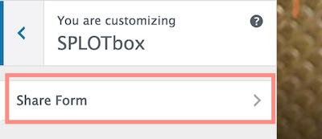

## Setting Up The Site Via SPLOTbox options

These instructions are a reference for the settings within the SPLOTbox; if you are reading this, you got as far as installing and activating the theme. Below are basic instructions for all of the theme options, which, if this were designed well, you likely do not need me to explain, but #BecauseDocumentation here we go. 

## Browse by Licenses

As of version 1.1 SPLOTbox provides links that display archives of content that have the same reuse license (if the feature is activated via the SPLOTbox options). This page is created automatically on new sites, or simply by activating the theme again (activate the parent Garfunkel, then activate SPLOTbox again).

This page (see [example](http://splot.ca/box/licensed/)) provides links to view all content with the licenses available on the sharing form. The url including `licensed/cc-by` yields all items with a Creative Commons CC By Attribution license [example](http://splot.ca/box/licensed/cc-by).

Use the page to find links to the ones you wish to use and add to your site's menus or widgets. If the links do not work, you may have to go to **Settings** -- **Permalinks** and just click save to regenerate the settings.

For extra flexibility there is a `[licensed]` shortcode that can be used in a widget or any page to display the same index list in a sidebar. By default, it lists only licenses used (e.g. it skips licenses with zero uses); to show all licenses, use the code `[licensed show="all"]`.

### Theme Options and Settings
Upon activation the theme will set up a **SPLOTbox Options** link that appears in the black admin bar at the top of your Wordpress Dashboard interface (when logged in), and in the "Appearance" tab on your Wordpress Dashboard. 

## Access and Publishing Controls

Leave the **Access Code** field blank if you want any visitor to be able to see and use the submission form on your site.

If you want to provide an access code (a very weak password), just enter it in this field. Visitors mist enter the correct code to see the full upload form.

Enter a decent **Access Hint** that will be displayed if someone does not enter the correct code.

#### Special Page Setup

Use this area to assign the two WordPress Pages used in the SPLOTbox. One to create the Sharing form and the other to display the content by reuse license applied (this can be ignored if this feature is not used).

You can now use any name you want for the URL (previously these were forced to be `/share` and `/licensed` -- this is no longer required).

If no Page is found with the correct template, you will see a prompt to create one. If the Page is found (and there might even be more than one, you can select the one you want used for each special page.

## Status for New Items

Ser the status for submitted content to your SPLOTbox. The Status for New Items lets you set up moderation for submissions (by choosing `draft` or `pending`) whereas `Publish immediately` provides instant gratification to your visitors, though leaves open the problems of a site where anyone can publish (the latter option thus works for sites where you set up an **Access Code** as described above).

There is no real difference between using `draft` or `pending` both are not public until their status is changed by a site admin; they are just organized differently in the dashboard.

Check **Enable Comments on Items**  to add a standard blog comment field at the bottom of all published items.

## Media Support

The checkboxes here allow you to control the types of sites that are able to add content directly to a SPLOTbox site by URL only (using WordPress embed or built in support for Internet Archive and Adobe Spark). This would allow you to maintain a site for only certain sources, say only video from YouTube or vimeo.

These checkboxes **should** be enabled, but you may have to manually set them.

Also, if you only want visitors adding media by URL, you can hide the uploader. And you can set a limit for upload size.

## Item Sorting 

The default settings for the display of itms are for typical blogs where newest content is displayed first. The sort options allow you to change that across the site- the home page, category/tag archives, and search results.

**Date Published** is the default option, the order is **Descending**, or newest first, change to **Ascending** to have oldest items appear first. 

Change the sort otder to **Title** to... yes... sort items alphabetically by each item's title.  Use **Ascending** for alphabetical order (A-Z) or **Descending** to reverse (Z-A).

## Single Item Display

You can control many of the other options to make your upload form simpler.,

You can choose to not ask visitors to set a category for their items and thus not have categories displayed on views. If you do use categories.. create them first! You can then select the default category that should be used for new items.

Like categories, you can choose to offer or hide a form field for entering tags.

You can choose to suppress the description field (if you want media shared only), or if making the description field available, you can require that it has something written in it.  The editor can either be simple text (no formatting) or the full visual editor, which also allows uploads of images to be used in the body text. Use the rich text editor when asking for longer amounts of description.

You can also choose to use a field if you want contributors to provide a source to credit for the media item.

## Admin Settings

Enter email addresses for people who should be notified of new submissions.

## License and Attribution

The **Use License Settings** enables a drop down menu offering a variety of options to indicate Creative Commons licenses as well as `All Rights Reserved` (boo!), `Usage Rights Unknown`, and `YouTube Standard License` which really just lets you embed videos..

Enabling the **Cut and Paste Attribution** adds to the display a field with an automatically formed attribution statement (based on the items's rights license choice) that can be copied after clicking on the text. Neat, eh? Attribution is a good thing.

## Customize the Share Form

You can now customize the field labels and the descriptions of the form where people submit new items to a SPLOTbox site. On your site navigate to the share form, and  activate the Wordpress Customizer from the admin bar. 

There is a special section at the bottom to open:

Then from this pane, open "Share Form" (eventually the theme options will live here too)

And then you will see a series of fields to edit for all form field elements. For each, you can edit the title/label of the field and the prompt that appears below. As you type in the customizer fields on the left, you will see a live preview on the right:

## Other Wordpressy Things You Might Want to Do

I like short links, so I typically use a Custom Permalink setting (under `Settings -- Permalinks`) of `/%post_id%/'

 

Set up your own menus as needed; make sure that you click the **Location** tab to tell Wordpress to use the menu you create as the **Primary** menu.

 

Get rid of the default widgets on the site; make 'em your own. 

 

Go build collections of media!

## Relatively Cool New Features & Updates

* (2.0) A big revamp, removing the need for special user accounts and secret logins. No logins are used to add content. The theme us much simpler, there is no special desk page for routing the access code. And the sharing form now has radio buttons that toggle the two different means of upload (by URL or by Upload)
* (1.9) Support included now for Giphy, Mixcloud, Flickr, Speakerdeck, and Slideshare, plus uploads now include ability to add images. The theme options can be used to limit the sites enabled. Also, the theme no longer needs a separate page for the random link generator (it's done all with code).
* (1.6-1.8) ! Yikes, someone forgot to list the new features. We are sure they were awesome.
* (1.5) Previews of submissions added to share form (displays as lightbox overlay). Pagination fixed for view by license template, shortcode added for license. Changed post format to not use content above more tag to find media URLs (Gunteberg comment tag danger), but reference media url stored in custom field (older formats still work). Tested to work with WordPress 5, Gutenberg, and newest version of parent theme. And, because the file got so long, `functions.php` has now been divided up into component files stored inside `/includes/'
* (1.0) Support added to allow submission of URLs for Adobe Spark Pages and Videos. Options added to hide form inputs for categories and tags if not needed. Fixed theme to use parent theme fonts and icons.
* (0.6) Template added to display media by type of open license applied
* (0.4) Support for Internet Archive audio and video embed from URL. Page genertor of links to all content with the same reuse license
* (0.3) Edit labels and instructions on the upload form using the Wordpress Customizer
* (0.2) A rich text editor can now be enabled for the description fields or you can opt to use the simpler plain text input text area for descriptions.
* (0.15) On new installs where no menus are defined, the theme generates a simple menu rather than listing all pages 